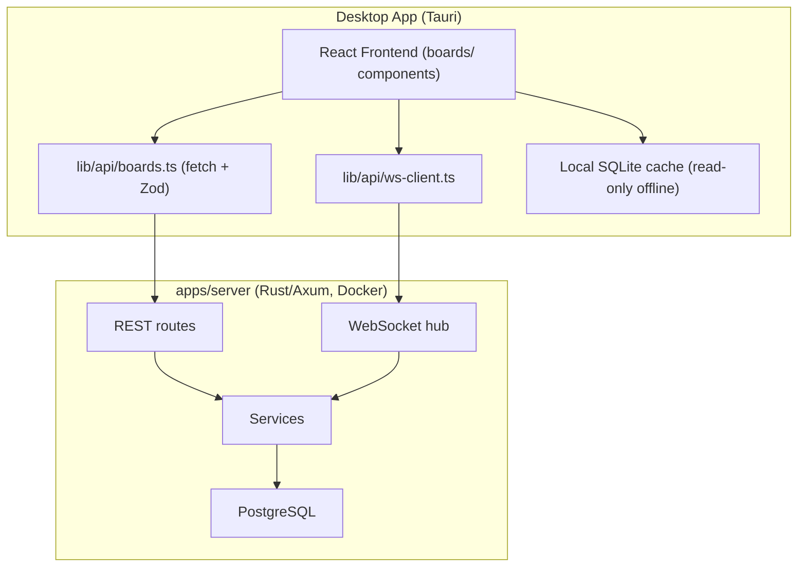

# Plan — Tessera Boards (Jira-like Project Management)

> Status: Planned | Owner: TBD | Created: 2026-06-05
> Adds collaborative boards/issues/teams inside the IDE via a self-hosted API server.
> Companion ADR (to be written with Phase 1): `docs/adr/000X-boards-collab-server.md`.

## 1. Goal

Let teams create boards, track issues, and collaborate in real time without
leaving the IDE. Jira-like: teams → boards → columns → issues, drag-drop,
live sync between connected team members.

**Server decision:** a new lightweight **Rust/Axum** HTTP + WebSocket server
(`apps/server`) running via Docker next to the existing PostgreSQL service.
One team member hosts it (LAN/VPN/cloud); others connect. Not peer-to-peer —
P2P sync is strictly harder (NAT traversal, conflict resolution, no source of
truth) for zero v1 benefit.

## 2. Local-first guarantee — must hold

Tessera promises *no remote code upload on the default path*. Boards follow the
sandbox precedent (ADR-0004 pattern):

- Boards are **opt-in, off by default**. No server configured → feature
  invisible, zero network calls.
- Only **board data** (issues, comments, team metadata) goes to the server.
  Source code, analysis, RAG chunks, and artifacts never leave the machine.
- Server is **self-hosted by the user's team** — no Tessera-operated cloud.
- ADR documenting this boundary ships in the same PR as Phase 1.

## 3. Scope

### v1 (this plan, Phases 1–5)

- Auth: register / login / refresh / logout.
- Teams: create, invite-code join, member roles (`admin` | `member` | `viewer`).
- Boards: CRUD, columns, labels.
- Issues: CRUD, drag-drop reorder, assignee, priority, type, markdown
  description, comments.
- Real-time: WebSocket sync per board.
- Offline: **read-only** local cache; reads work offline, writes require
  connection.

### v2 (separate plan, after v1 ships)

- Sprints + burndown.
- Activity feed / audit log.
- Subtasks, WIP limits, story points.
- Git integration (branch auto-create, commit ↔ issue-key linking).
- Offline write queue + sync.
- Avatar upload.

Cutting v2 halves the file count (~20 v1 files vs ~38) and validates the
server architecture before investing in sprint machinery.

## 4. Open questions (answer before Phase 1)

1. **Team discovery** — invite-only (admin generates code) assumed. OK?
2. **Hosting story** — docker-compose on one teammate's machine assumed for
   v1. Documented cloud deploy (Fly/Railway/VPS) is a docs-only follow-up.

## 5. Architecture



Server mirrors the desktop crate's layering: `routes/` (thin, validate,
delegate) → `services/` (logic, no SQL) → `repositories/` (SQL only) →
`models/`. Same rulebook applies (§ layering, parameterized SQL, no
`unwrap()`).

### 5.1 Auth model

- **Server owns JWT signing.** The desktop app never holds the signing
  secret (it would ship in the binary). Desktop stores access + refresh
  tokens and sends `Authorization: Bearer <token>`.
- Token storage on desktop: OS keychain via Tauri (not localStorage).
- Refresh tokens: rotated on every use, revoked on logout, stored hashed
  server-side.
- Shared crypto (Argon2 params, JWT claims shape) extracted from
  `apps/desktop/src-tauri/src/auth/` into a small workspace crate
  `crates/auth-core` consumed by both desktop and server — no copy-paste
  drift.
- Rate limiting on `/auth/*` (tower middleware, per-IP).
- The existing placeholder `auth-store.ts` / auth IPC flows are migrated to
  this real flow in Phase 3.

### 5.2 WebSocket auth + lifecycle

- JWT validated **on upgrade** (from the upgrade request header).
- `join(board_id)` authorized server-side: user must be a member of the
  board's team, else close with policy violation. No membership check = any
  valid token can read any board — not acceptable.
- Client: heartbeat ping every 30 s, reconnect with exponential backoff,
  **full board resnapshot on reconnect** (missed events while disconnected
  cannot be replayed in v1).
- Events are **deltas** (one issue, one comment), never full-board payloads.

### 5.3 Concurrency + ordering (the hard 5%)

- **Issue ordering:** `position` is `DOUBLE PRECISION` with midpoint
  insertion (place between neighbours at `(a+b)/2`). Server rebalances a
  column when gaps exhaust (`abs(a-b) < 1e-9`). Plain integer positions
  corrupt under concurrent drag-drop.
- **Field edits:** optimistic concurrency. `issues.version int` — client
  sends the version it read; mismatch → `409 Conflict`, client refetches and
  reapplies. No blind last-write-wins.
- **Issue keys:** allocated atomically in one statement, never
  read-then-write:

  ```sql
  UPDATE boards SET issue_counter = issue_counter + 1
  WHERE id = $1
  RETURNING issue_counter;
  ```

## 6. Data model — `apps/server/migrations/0001_boards_init.sql`

PostgreSQL, UUID PKs, FK indexes on every relation.

| Table | Columns (key ones) |
|---|---|
| `users` | `id`, `email` UK, `display_name`, `password_hash`, timestamps |
| `refresh_tokens` | `id`, `user_id` FK, `token_hash`, `expires_at`, `revoked_at` |
| `teams` | `id`, `name`, `description`, `invite_code` UK, `created_by` FK |
| `team_members` | `team_id` FK, `user_id` FK, `role` (`admin`\|`member`\|`viewer`), UNIQUE(team_id, user_id) |
| `boards` | `id`, `team_id` FK, `name`, `key` (e.g. `TEST`), `board_type` (`kanban` only in v1), `issue_counter` |
| `board_columns` | `id`, `board_id` FK, `name`, `color`, `position` |
| `labels` | `id`, `board_id` FK, `name`, `color` |
| `issues` | `id`, `board_id` FK, `column_id` FK, `issue_key` UK, `issue_type` (`epic`\|`story`\|`task`\|`bug`), `title`, `description` (markdown), `priority`, `assignee_id` FK nullable, `reporter_id` FK, `position DOUBLE PRECISION`, `version int`, timestamps |
| `issue_labels` | `issue_id` FK, `label_id` FK, composite PK |
| `comments` | `id`, `issue_id` FK, `author_id` FK, `body` (markdown), timestamps |

Deferred to v2 migrations: `sprints`, `activity_logs`, `issues.sprint_id`,
`issues.parent_id`, `issues.story_points`, `issues.due_date`,
`issues.git_branch`.

Explicit indexes beyond FKs:

- `issues(board_id, column_id, position)` — column rendering + cursor pagination.
- `issues(issue_key)` UNIQUE.
- `comments(issue_id, created_at)`.

## 7. API surface (v1)

```
POST   /auth/register  /auth/login  /auth/refresh  /auth/logout
GET    /auth/me

POST   /teams                      GET /teams
POST   /teams/join                 (invite code)
GET    /teams/:id/members          PATCH/DELETE member (role mgmt, admin only)

POST   /teams/:id/boards           GET /teams/:id/boards
GET    /boards/:id                 (board + columns + labels, no issues)
PATCH  /boards/:id                 POST/PATCH/DELETE columns, labels

GET    /boards/:id/issues?column=&after=&limit=100   (cursor-paginated)
POST   /boards/:id/issues
GET    /issues/:id                 PATCH /issues/:id   (requires version)
POST   /issues/:id/move            (column_id + neighbour ids → server computes position)
DELETE /issues/:id

GET    /issues/:id/comments?after=&limit=50
POST   /issues/:id/comments        PATCH/DELETE /comments/:id

GET    /health                     (for docker-compose healthcheck)
GET    /ws                         (upgrade; auth on upgrade request)
```

All list endpoints paginated (repo rule — no exceptions). `move` takes
*neighbour issue ids*, not a raw position — server computes the fractional
position so clients can't corrupt ordering.

### WS events (v1)

`issue_created` · `issue_updated` · `issue_moved` · `issue_deleted` ·
`comment_added` · `comment_updated` · `comment_deleted` ·
`column_changed` · `member_joined` · `member_left`

## 8. Proposed changes

### Phase 1 — Server foundation

#### [NEW] `apps/server/`

```
apps/server/
├── Cargo.toml             # workspace member
├── src/
│   ├── main.rs            # axum entry; runs sqlx migrations on boot
│   ├── config.rs          # PORT, DATABASE_URL, JWT_SECRET (fail fast if missing)
│   ├── error.rs           # ApiError → consistent JSON error body
│   ├── db/mod.rs          # PgPool setup
│   ├── middleware/auth.rs # JWT extraction → AuthedUser extension
│   ├── routes/            # auth, teams, boards, issues, comments, ws, health
│   ├── services/          # auth_service, team_service, board_service,
│   │                      # issue_service (ordering + version logic), ws_hub
│   ├── repositories/      # SQL only (sqlx::query! macros)
│   └── models/            # serde structs — source of truth for the contract
└── migrations/0001_boards_init.sql
```

#### [NEW] `crates/auth-core/`

Argon2 hashing + JWT claims/sign/verify extracted from
`apps/desktop/src-tauri/src/auth/`. Desktop re-exports; behavior unchanged.

#### [MODIFY] `docker-compose.yml`

```yaml
  tessera-server:
    build: ./apps/server
    container_name: tessera-server
    restart: unless-stopped
    depends_on:
      postgres:
        condition: service_healthy
    environment:
      DATABASE_URL: postgres://${POSTGRES_USER:-testing_ide}:${POSTGRES_PASSWORD:-testing_ide_dev_password}@postgres:5432/${POSTGRES_DB:-testing_ide}
      JWT_SECRET: ${JWT_SECRET:?set JWT_SECRET in .env}
      PORT: 3001
    ports:
      - "127.0.0.1:${SERVER_PORT:-3001}:3001"
    healthcheck:
      test: ["CMD", "curl", "-f", "http://localhost:3001/health"]
      interval: 10s
      timeout: 5s
      retries: 10
```

`JWT_SECRET` is **required** (`:?`), no insecure default baked into compose.

#### [MODIFY] `.env.example`

```env
# Tessera Boards API server
SERVER_PORT=3001
TESSERA_SERVER_URL=http://localhost:3001
JWT_SECRET=            # required for tessera-server; >= 32 random bytes
```

#### [MODIFY] CI workflow

Add server job: `cargo clippy --manifest-path apps/server/Cargo.toml --locked
--all-targets -- -D warnings` + `cargo test`. Docker build uses
`SQLX_OFFLINE=true` with checked-in `.sqlx/` metadata (no DB at build time).

### Phase 2 — Shared contract

#### [NEW] `packages/shared/src/schemas/board.schema.ts`

Zod schemas **only** — TS types via `z.infer`, per §12.3.1. No separate
hand-written `types/board.ts` file. Server serde structs are the source of
truth; round-trip contract test (fixture JSON from server tests parsed by
Zod) in the same PR.

#### [MODIFY] `packages/shared/src/index.ts`

Export new schemas + inferred types.

### Phase 3 — Desktop client + store

#### [NEW] `apps/desktop/src/lib/api/boards.ts`

HTTP client (`fetch` in Tauri webview). Every response parsed with Zod before
it touches state. Lives in `lib/api/` not `lib/ipc/` — it is HTTP, not Tauri
IPC; same validation discipline.

#### [NEW] `apps/desktop/src/lib/api/ws-client.ts`

`BoardWebSocket`: connect(token, boardId), heartbeat, backoff reconnect,
resnapshot on reconnect, typed event handlers (Zod-validated events).

#### [NEW] `apps/desktop/src/stores/board-store.ts`

Zustand store: server connection state, active team/board, columns, paginated
issues, members. Subscribes to WS events, applies deltas. Optimistic UI for
drag-drop with rollback on 409/error.

#### [MODIFY] auth migration

`auth-store.ts` + auth IPC placeholder flows replaced with real server auth
(login/register/refresh against `apps/server`, tokens in OS keychain).

### Phase 4 — Frontend UI

#### [NEW] `apps/desktop/src/components/boards/` (v1 set)

```
board-panel.tsx          board-sidebar.tsx       kanban-board.tsx
kanban-column.tsx        issue-card.tsx          issue-detail-modal.tsx
issue-create-modal.tsx   filters-bar.tsx         board-settings.tsx
team-management.tsx      member-avatar.tsx       priority-badge.tsx
server-connect-modal.tsx team-invite-modal.tsx
```

- Kanban columns **virtualized** (`@tanstack/react-virtual`) — 1000-issue
  perf target is unreachable unvirtualized.
- Design language: existing theme — `#131313`/`#1c1b1b` surfaces,
  teal `#6bd8cb`/`#29a195` accents, glassmorphism cards, lucide icons,
  framer-motion drag/entrance. Priority colors: Critical `#ffb4ab`,
  High `#f59e0b`, Medium `#6bd8cb`, Low `#94a3b8`, Trivial `#64748b`.

#### [MODIFY] `App.tsx`, `app-shell.tsx`, `toolbar.tsx`

Mode switcher: **Code Mode** (current layout) ↔ **Boards Mode**
(board sidebar + kanban + detail). Toolbar gets Boards button + connection
status dot. Boards button hidden until a server URL is configured (opt-in
invisible-by-default rule, §2).

#### [MODIFY] `settings-sheet.tsx`

"Boards" section: server URL, account (password / display name), team
shortcuts.

### Phase 5 — Offline cache + hardening

- Local SQLite cache (separate file from analysis DB): last-seen board
  snapshot for offline **reads**; banner shows "offline — read only".
- Server: request body size limits, JSON depth limits, audit of all
  endpoints against role matrix (viewer = read-only, member = CRUD own
  issues + comments, admin = everything).
- Load test: seed 1000 issues, assert board load < 500 ms (paginated) and
  WS delivery < 100 ms LAN.

## 9. File change summary

| Category | New | Modified |
|---|---|---|
| Server (Ph 1) | ~14 in `apps/server/` + `crates/auth-core/` | `docker-compose.yml`, `.env.example`, CI workflow |
| Shared (Ph 2) | 1 schema file | `packages/shared/src/index.ts` |
| Desktop client (Ph 3) | `boards.ts`, `ws-client.ts`, `board-store.ts` | `auth-store.ts` + auth IPC |
| UI (Ph 4) | ~14 components | `App.tsx`, `app-shell.tsx`, `toolbar.tsx`, `settings-sheet.tsx` |
| Offline (Ph 5) | cache module | — |
| **Total v1** | **~22** | **~8** |

## 10. Verification

### Automated

```bash
# Server
cargo test --manifest-path apps/server/Cargo.toml
cargo clippy --manifest-path apps/server/Cargo.toml --locked --all-targets -- -D warnings

# Shared contract round-trip
pnpm --filter @testing-ide/shared run test

# Desktop
pnpm --filter @testing-ide/desktop run test:frontend
pnpm typecheck && pnpm lint
```

Server unit tests must cover: fractional reorder (incl. rebalance trigger),
issue-key allocation under concurrent inserts, version-conflict 409, WS room
authorization (non-member rejected), invite-code join, role matrix.

### Manual

1. `docker compose up` → postgres + server healthy, migrations applied.
2. Register → login → token refresh → logout revokes refresh token.
3. Create team → invite code → second instance joins.
4. Board CRUD → issues → drag-drop reorder survives two clients moving
   cards concurrently (no duplicate/corrupt positions).
5. Two IDE instances on one board: card move appears on both < 100 ms LAN.
6. Edit same issue on both → second save gets conflict prompt, not silent
   overwrite.
7. Kill server → boards still readable from cache, writes blocked with
   banner → restart → resync.
8. Theme consistency with existing panels.

### Performance criteria

- Board load < 500 ms at 1000 issues (paginated + virtualized).
- WS delivery < 100 ms LAN.
- Drag-drop re-render < 16 ms.

## 11. Risks

| Risk | Mitigation |
|---|---|
| Server is a second deployable — ops burden on teams | docker-compose one-liner; `/health`; docs for LAN/VPN/cloud hosting |
| Schema drift desktop ↔ server | single Zod contract in `packages/shared` + round-trip tests; serde source of truth |
| Concurrent edits corrupt data | fractional positions + server-computed moves + `version` optimistic locking |
| Auth weaknesses | server-only signing secret, rotated refresh tokens, rate-limited auth routes, keychain storage |
| Scope creep | fenced v2 plan: sprints/activity/git-linking |
